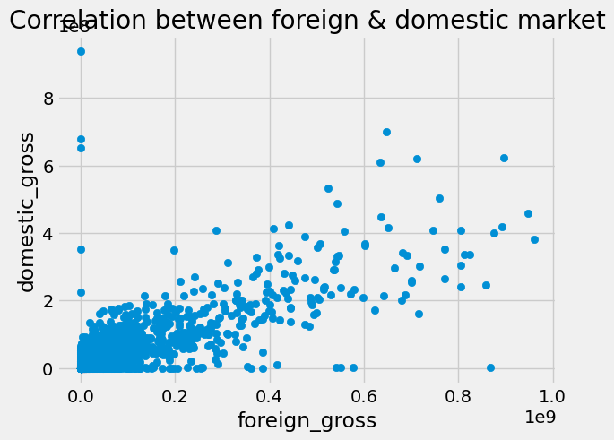

# Microsoft Movies
Microsoft wants to venture into the movie industry.
this project is intended to help microsoft explore what types of films are currently doing the best in the market.

## Business Understanding
the project seeks to answer the following questions:
1. Which genre(s) are rated the best?
2. What are the most popular movie genre(s)?
3. What is the relationship between the rating and runtime of a movie?
4. Who are the pioneers in the industry?
5. whether there is any relationship between domestic and international marketing of a movie

## Data Understanding and Analysis

### Data Understanding

The data we are going to use for our analysis is from the web and contained in:

1. `im.db`: which is a database from which 
    `movie_basics` and `movie_ratings` tables are extracted. `im.db` is in sqlite folder
2. `bom.movie_gross.csv.gz`: which is a CSV file

### Data  Analysis
Data obtained was cleaned and then analyzed using the following tools:
1. Python pandas  
2. Jupyter notebook 

## Findings
An analysis of the data established the following key observations:
1. That Documentary movies had the highest rating followed by Drama then Comedy in that order as shown by the graph below.

2. It was observed that Drama was the most popular type of all the movies among the population. this was followed by Documentary then Comedy as can be seen below

3. It was found that there is correlation between the ability to perform in the domestic market and international market

## Summary of Key Recommendations
1. The success of a studio/business depends on the type of movie it produces. Development should therefore focus purely on the following types of movies that are currently doing the best as per the order below;
    1. Documentary
    2. Drama 
    3. Comedy
    4. Comedy, drama
    5. Horror
    6. biography, documentary
2. Ability to do well in the international market depends on ability to do well locally. It is therefore recommend that a studio should focus first on doing well in the domestic market before venturing into the international one.

3. The analysis also established that movies that scored high rating were also part of the most popular ones.
Therefore, development of content should focus on the quality of content produced.
#### For more detailed information, find the;

[project presentation](./presentation.pdf) for further details

[jupyter notebook](./Microsoft_Movies.ipynb) for code implementation of the project

### The End!

